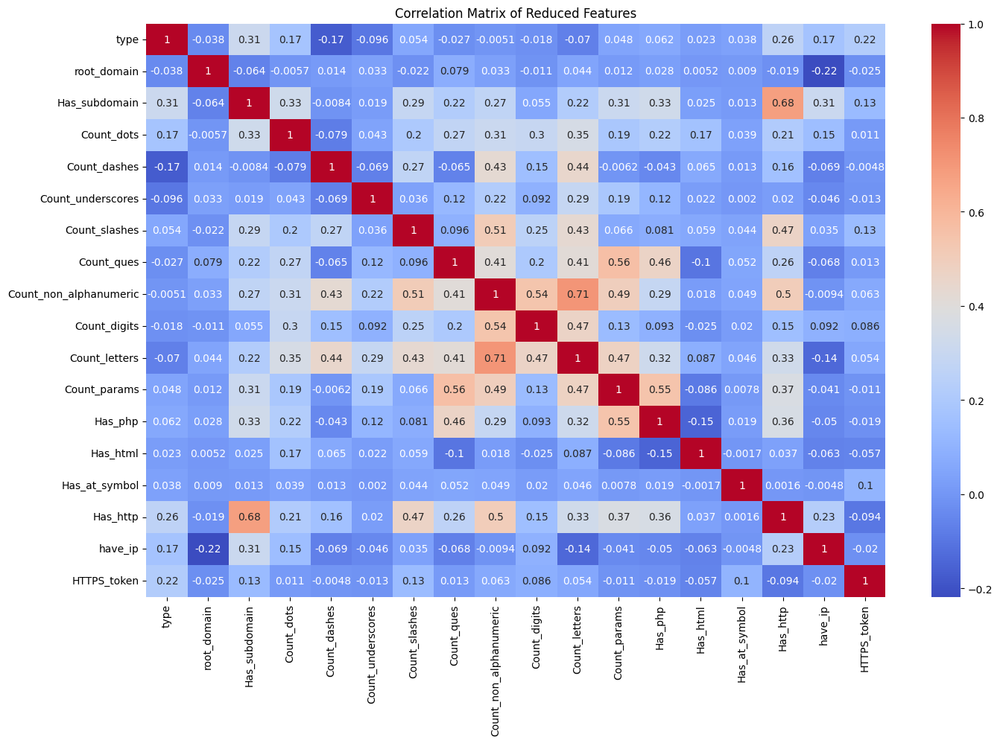
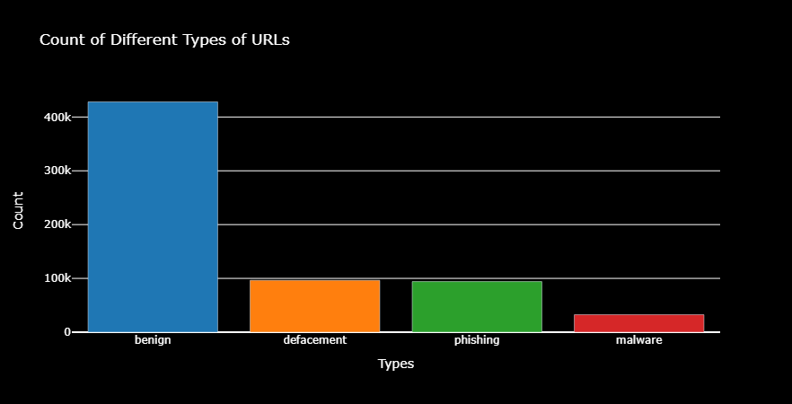
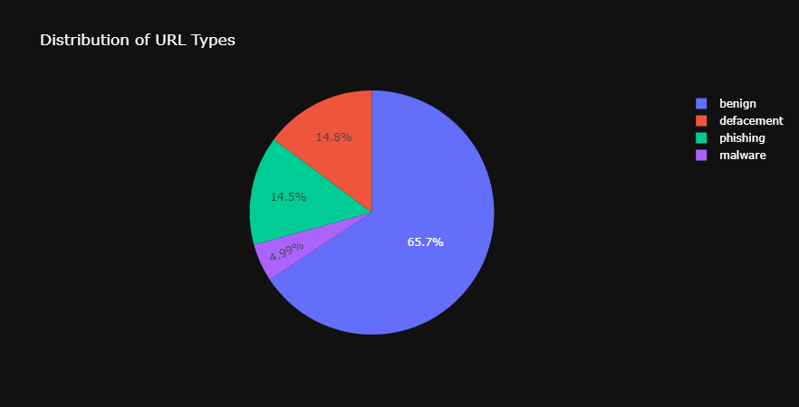
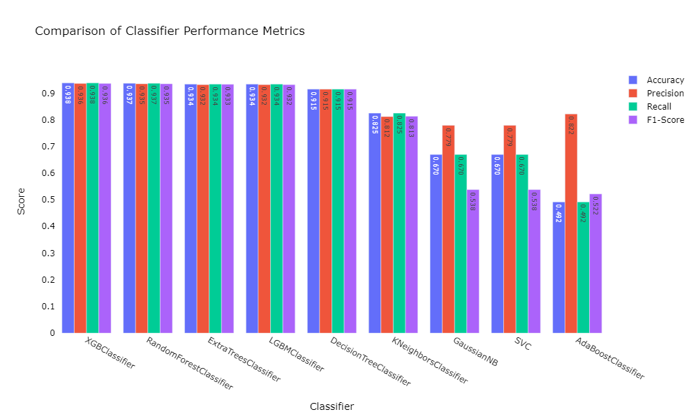
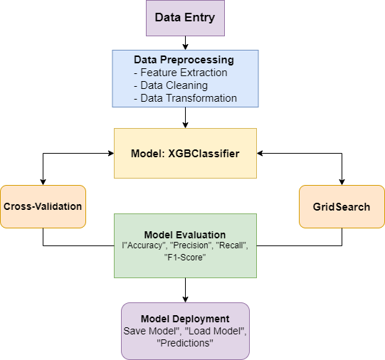

# URL Classification Project

## Overview
This project aims to classify URLs into different types (benign, defacement, phishing, malware) using various machine learning models. The project involves feature extraction from URLs and evaluating multiple classifiers to identify the best-performing model.

## Dataset
The dataset contains URLs and their corresponding types:
- **URL**: The URL to be classified.
- **Type**: The type of the URL (benign, defacement, phishing, malware).

## Project Structure
- `import_libraries.py`: Script to import necessary libraries.
- `define_functions.py`: Script defining functions for feature extraction from URLs.
- `process_data.py`: Script to load, clean, and preprocess the data.
- `train_model.py`: Script to train and evaluate machine learning models.
- `model_selection.py`: Script to evaluate multiple classifiers and identify the best-performing model.

## Data Processing
### Feature Extraction
The features are extracted from the URLs using functions defined in `define_functions.py`. These features include various characteristics of the URLs that help in classification.


The application extracts the following features from a given URL to make predictions:

#### URL Structure Features
- **Has Subdomain**: Checks if the URL contains a subdomain.
- **Root Domain**: Extracts the root domain of the URL and hashes it as an integer.

##### Character Count Features
- **Count Dots**: Counts the number of dots ('.') in the URL.
- **Count Dashes**: Counts the number of dashes ('-') in the URL.
- **Count Underscores**: Counts the number of underscores ('_') in the URL.
- **Count Slashes**: Counts the number of slashes ('/') in the URL.
- **Count Question Marks**: Counts the number of question marks ('?') in the URL.
- **Count Non-Alphanumeric Characters**: Counts the number of non-alphanumeric characters in the URL.
- **Count Digits**: Counts the number of digits in the URL.
- **Count Letters**: Counts the number of letters in the URL.

#### Parameter Count Features
- **Count Parameters**: Counts the number of parameters in the URL query string.

#### Presence of Specific Substrings
- **Has PHP**: Checks if the URL contains 'php'.
- **Has HTML**: Checks if the URL contains 'html'.
- **Has At Symbol**: Checks if the URL contains the '@' symbol.
- **Has Double Slash**: Checks if the URL contains a double slash ('//').
- **Has HTTP**: Checks if the URL uses the HTTP scheme.
- **Has HTTPS**: Checks if the URL uses the HTTPS scheme.

#### Security Features
- **Have IP Address**: Checks if the URL contains an IP address.
## Results

### 1. Correlation Matrix
The correlation matrix plot shows the relationship between different features and the target variable (type). It helps to identify which features are more relevant for the classification task.



### 2. Count of Different Types of URLs
This bar plot displays the distribution of different URL types in the dataset. It helps to understand the class imbalance in the dataset.



### 3. Distribution of URL Types
This pie chart shows the percentage distribution of each URL type in the dataset, providing a visual representation of the class proportions.



### 4. Word Cloud of URLs
The word cloud visualizes the most common terms found in the URLs. It helps to understand the common patterns and words used in different types of URLs.


### Data Splitting
The data is split into training and testing sets to evaluate model performance.

## Model Selection and Training
### Models Used
The following classifiers were evaluated:
- DecisionTreeClassifier
- RandomForestClassifier
- AdaBoostClassifier
- KNeighborsClassifier
- ExtraTreesClassifier
- GaussianNB
- XGBClassifier
- LGBMClassifier
- SVC


### Evaluation Method
The models were evaluated using 5-fold cross-validation. The performance metrics included accuracy, recall, precision, and F1 score.

#### 1. Classifier Performance Comparison
This bar plot compares the performance metrics (accuracy, precision, recall, F1 score) of different classifiers. The XGBClassifier shows the highest performance across all metrics.



### 2. Classifier Performance Table
This table summarizes the performance of each classifier in terms of accuracy, precision, recall, and F1 score.

## Classifier Performance Table

| **Model**                | **Accuracy** | **Precision** | **Recall** | **F1-Score** |
|--------------------------|--------------|---------------|------------|--------------|
| XGBClassifier            | 0.938        | 0.936         | 0.938      | 0.936        |
| RandomForestClassifier   | 0.937        | 0.935         | 0.937      | 0.935        |
| ExtraTreesClassifier     | 0.934        | 0.932         | 0.934      | 0.933        |
| LGBMClassifier           | 0.934        | 0.932         | 0.934      | 0.932        |
| DecisionTreeClassifier   | 0.915        | 0.915         | 0.915      | 0.915        |
| KNeighborsClassifier     | 0.825        | 0.812         | 0.825      | 0.813        |
| GaussianNB               | 0.670        | 0.779         | 0.670      | 0.538        |
| SVC                      | 0.670        | 0.779         | 0.670      | 0.538        |
| AdaBoostClassifier       | 0.492        | 0.822         | 0.492      | 0.522        |


## Results
### Performance Metrics
The XGBClassifier outperformed the other models with the highest accuracy and balanced performance across all metrics.

### Hyperparameter Tuning
- The XGBClassifier was used with specific parameters to enhance performance.
- The LGBMClassifier was instantiated with verbosity reduced to disable logs.


## Discussion
### Interpretation of Results
- The XGBClassifier demonstrated superior performance in classifying URLs, making it the best choice for this task.



## Model Evaluation Results

| **Metric**                | **Value**  |
|---------------------------|------------|
| **Best Parameters**       |            |
| colsample_bytree          | 1.0        |
| learning_rate             | 0.2        |
| max_depth                 | 7          |
| n_estimators              | 300        |
| subsample                 | 0.8        |
| **Best Test Accuracy**    | 0.95       |
| **Best Test Recall**      | 0.95       |
| **Best Test Precision**   | 0.95       |
| **Best Test F1-Score**    | 0.95       |


### Model Strengths and Weaknesses
- **Strengths**: High accuracy, good balance between precision and recall.
- **Weaknesses**: Occasionally predicts false positives.

### Business Implications
- This model can be used to identify malicious URLs, enhancing security measures for users effectively.

### Future Work
- Further exploration of other algorithms and more extensive hyperparameter tuning.
- Incorporation of additional features and larger datasets to improve model robustness.

## How to Run
1. Clone the repository:
    ```bash
    git clone https://github.com/ghafari2019/DNS-Filtering-system.git
    ```
2. Navigate to the project directory:
    ```bash
    cd C:\Users\User\DNS-Filtering-system\ML Model
    ```

3. Install required libraries:
    ```bash
    pip install -r requirements.txt
    ```
4. Run the scripts in the following order:
    ```bash
    python import_libraries.py
    python define_functions.py
    python process_data.py
    ```
    ```bash
    python model_selection.py
    ```
    ```bash
    python train_model.py
    ```

    
## Conclusion
This project demonstrates an effective approach to classifying URLs using machine learning. Identifying potentially harmful URLs enhances the overall security measures for web users.


