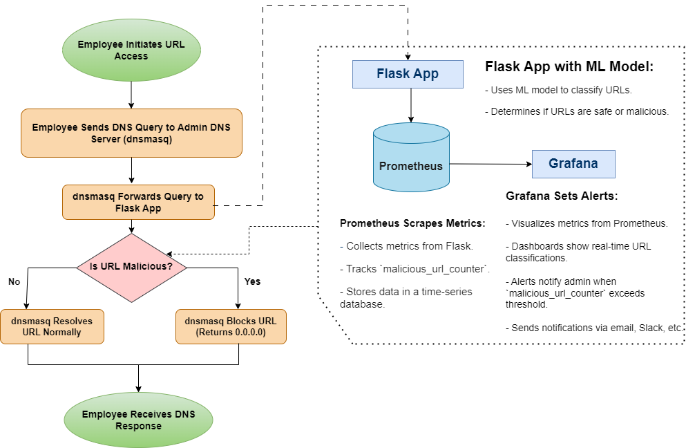

# DNS Filtering System with Machine Learning

## Table of Contents

  - [Overview](#overview)
  - [Network Size Suitability](#network-size-suitability)
    - [Scaling for Larger Networks](#scaling-for-larger-networks)
  - [How the System Works](#how-the-system-works)
    - [DNS Resolution and Filtering](#dns-resolution-and-filtering)
    - [Automation and Monitoring](#automation-and-monitoring)
  - [Alternative Methods for URL Filtering](#alternative-methods-for-url-filtering)
    - [1. Blacklisting and Whitelisting](#1-blacklisting-and-whitelisting)
    - [2. Signature-Based Filtering](#2-signature-based-filtering)
    - [3. Proxy-Based Filtering](#3-proxy-based-filtering)
    - [4. Content Filtering](#4-content-filtering)
    - [5. Machine Learning-Based Filtering](#5-machine-learning-based-filtering)
  - [Why Our Method is Better](#why-our-method-is-better)
    - [1. Integration of DNS Filtering with Machine Learning](#1-integration-of-dns-filtering-with-machine-learning)
    - [2. Real-Time URL Classification](#2-real-time-url-classification)
    - [3. Automation and Monitoring with Prometheus and Grafana](#3-automation-and-monitoring-with-prometheus-and-grafana)
    - [4. Scalability and Flexibility](#4-scalability-and-flexibility)
    - [5. Cost-Effective and Open Source](#5-cost-effective-and-open-source)
  - [Summary](#summary)

## Overview

This DNS filtering system automatically recognizes and handles malicious URLs without requiring manual intervention from employees. The system integrates `dnsmasq`, a Flask application, and machine learning to ensure robust and adaptive protection against harmful content.

## Network Size Suitability

This method is particularly well-suited for small to medium-sized networks, typically defined as:

- **Small Networks**: Up to 50 devices
- **Medium-Sized Networks**: Between 50 and 500 devices

For networks larger than this range, modifications and enhancements may be needed to ensure optimal performance and reliability. 

### Scaling for Larger Networks

For larger networks, above the medium size (500+ devices), consider the following adjustments:

- **Load Balancing**: Distribute the DNS query load across multiple instances of `dnsmasq` and the Flask application.
- **High Availability**: Implement redundancy for `dnsmasq` and Flask instances to ensure continuous operation.
- **Enhanced Monitoring**: Increase the granularity of monitoring with Prometheus and Grafana to manage the higher load effectively.
- **Optimized Machine Learning Models**: Utilize more powerful machine learning models and potentially distribute the classification workload across multiple servers.

## How the System Works

### DNS Resolution and Filtering

1. **dnsmasq**: Acts as the local DNS server, directing all DNS queries through it.
2. **Flask Application**: Receives DNS queries forwarded by `dnsmasq` and uses a machine learning model to classify URLs.
3. **Classification**: The machine learning model classifies URLs as benign, defacement, phishing, or malware.
4. **Response**: Based on the classification, the system allows or blocks the URL. Malicious URLs are blocked, protecting employees from harmful content.

### Automation and Monitoring

1. **Prometheus**: Collects and monitors metrics from the Flask application and the overall system.
2. **Grafana**: Visualizes these metrics and sets up alerts for specific conditions (e.g., high memory usage, detection of malicious URLs).

## Alternative Methods for URL Filtering

There are several alternative methods for URL filtering, each with its own advantages and disadvantages. Here are some common approaches:

### 1. Blacklisting and Whitelisting
- **Blacklisting**: Blocking access to known malicious or inappropriate websites by maintaining a list of URLs or domains.
- **Whitelisting**: Allowing access only to approved websites, blocking all others by default.
- **Pros**: Simple to implement and understand.
- **Cons**: Requires constant updates; blacklists can miss new threats and whitelists can be overly restrictive.

### 2. Signature-Based Filtering
- **How It Works**: Uses a database of known malware signatures and patterns to identify and block malicious URLs.
- **Pros**: Effective against known threats; can be integrated with antivirus software.
- **Cons**: Ineffective against new, unknown threats (zero-day attacks).

### 3. Proxy-Based Filtering
- **How It Works**: Routes all web traffic through a proxy server that filters URLs based on set rules and policies.
- **Pros**: Centralized control; can apply comprehensive policies.
- **Cons**: Single point of failure; can introduce latency.

### 4. Content Filtering
- **How It Works**: Inspects the content of web pages in real-time to determine if they contain malicious or inappropriate material.
- **Pros**: Comprehensive filtering based on actual content.
- **Cons**: Computationally intensive; may impact browsing performance.

### 5. Machine Learning-Based Filtering
- **How It Works**: Uses machine learning models to analyze URLs and predict their safety based on various features and patterns.
- **Pros**: Adaptive and can improve over time with more data; effective against new and evolving threats.
- **Cons**: Requires initial setup and training; may need substantial data for accurate predictions.

## Why Our Method is Better
Our method combines the strengths of several approaches while addressing their individual weaknesses. Here’s a detailed comparison and explanation of why our method stands out:

### 1. Integration of DNS Filtering with Machine Learning
- **Automation and Intelligence**: By using `dnsmasq` to handle DNS queries and a Flask application with a machine learning model, our system automatically classifies and handles URLs without manual intervention. This combines the efficiency of DNS filtering with the adaptive capabilities of machine learning.
- **Advantage**: Unlike simple blacklisting/whitelisting, our system can recognize new threats by learning from patterns and behaviors, reducing the risk of zero-day attacks.

### 2. Real-Time URL Classification
- **Dynamic Response**: The Flask application processes DNS queries in real-time, classifying URLs as benign, defacement, phishing, or malware.
- **Advantage**: Provides immediate protection against malicious URLs, unlike signature-based methods that may not catch new threats.

### 3. Automation and Monitoring with Prometheus and Grafana
- **Comprehensive Monitoring**: Prometheus collects metrics from the system, while Grafana visualizes these metrics and sets up alerts.
- **Advantage**: Continuous monitoring and alerting enhance the security and reliability of the system, providing insights into its performance and potential issues.

### 4. Scalability and Flexibility
- **Scalable Design**: Both `dnsmasq` and Flask are lightweight and can handle varying loads, making the system scalable for different network sizes.
- **Advantage**: Suitable for small to medium-sized networks, it ensures performance is not compromised as the network grows.

### 5. Cost-Effective and Open Source
- **Low Cost**: Both `dnsmasq` and Flask are open-source, minimizing licensing and operational costs.
- **Advantage**: Offers an effective security solution without significant financial investment, making it accessible for smaller organizations.

## Summary

Our DNS filtering system combines the efficiency of `dnsmasq` for DNS resolution, the adaptability of machine learning through a Flask application, and robust monitoring with Prometheus and Grafana. This approach ensures:
- Automated and intelligent URL classification and filtering.
- Real-time protection against a wide range of threats.
- Comprehensive monitoring and alerting.
- Scalability to handle growth.
- Cost-effectiveness.

By integrating these technologies, our method provides a robust, adaptive, and scalable solution that addresses the limitations of other URL filtering methods while enhancing overall network security.

 

