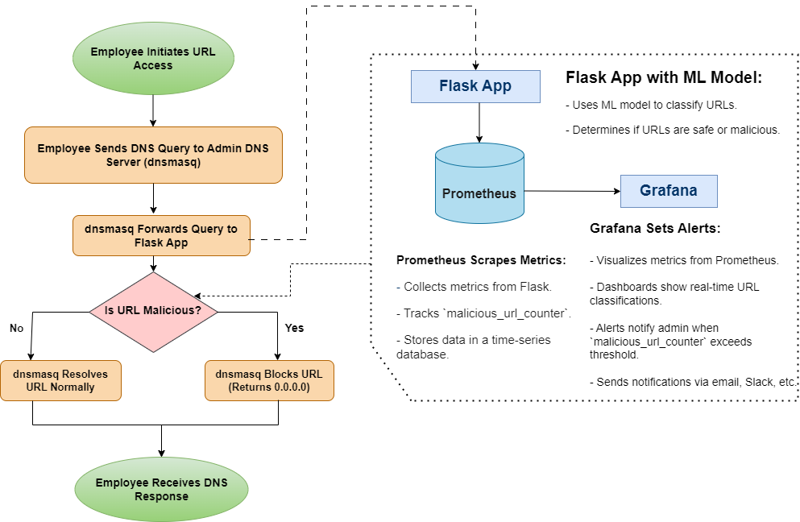

# Overview of the DNS Filtering System

The DNS filtering system we have set up automatically recognizes and handles malicious URLs without requiring manual intervention from employees. Here's how the system works and how to test it to ensure it functions properly:

## How the System Works

### 1. DNS Resolution and Filtering:
- **dnsmasq**: Acts as the local DNS server. All DNS queries are directed through dnsmasq.
- **Flask Application**: Receives DNS queries forwarded by dnsmasq and uses a machine learning model to classify the URLs.
- **Classification**: The machine learning model classifies URLs as benign, defacement, phishing, or malware.
- **Response**: Based on the classification, the system allows or blocks the URL. Malicious URLs are blocked, ensuring that employees are protected from harmful content.

### 2. Automation and Monitoring:
- **Prometheus**: Collects and monitors metrics from the Flask application and the overall system.
- **Grafana**: Visualizes these metrics and sets up alerts for specific conditions (e.g., high memory usage, detection of malicious URLs).

## Detailed Instructions for Clients

### 1. DNS Configuration:
- Set the primary DNS server in the client's network settings to the IP address of the dnsmasq server.

### 2. Access Grafana for Monitoring:
- **URL**: Open Grafana at `http://<grafana_server_ip>:3000`.
- **Login**: Use provided credentials to access dashboards.
- **Dashboards**: Monitor system metrics and check for any alerts.

### 3. Automatic Detection and Blocking:
- **No Manual Intervention**: The system automatically classifies and blocks malicious URLs.
- **Real-Time Monitoring**: Clients can view real-time data and historical metrics in Grafana dashboards.

## Benefits

- **Automatic URL Filtering**: No manual checks are needed; the system handles all URL classifications automatically.
- **Real-Time Monitoring and Alerts**: Clients can see live metrics and receive immediate notifications for critical issues.
- **Improved Security**: Using a machine learning model, the system continuously adapts and improves its accuracy in detecting malicious URLs.

This setup ensures that employees are protected from malicious URLs automatically, with minimal impact on their workflow. The comprehensive monitoring and alerting system further enhances security and reliability.
